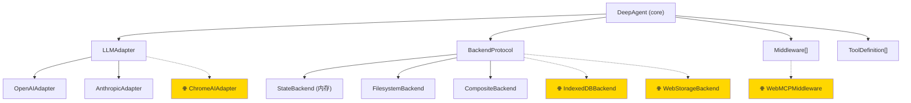

# TDeepAgents 架构可扩展性分析

## 总体评价：✅ 好消息 — 核心接口设计是可扩展的

当前架构通过 4 个核心 interface 做到了关注点分离：



> 虚线 = 未来扩展，仅需实现 interface，**零核心代码改动**

---

## 逐特性扩展性评估

### 1. 浏览器运行时 — IndexedDB/WebStorage Backend

| 维度 | 评分 | 说明 |
|------|------|------|
| 接口适配难度 | ⭐⭐⭐⭐⭐ 容易 | [BackendProtocol](file:///Users/xyliu3/Desktop/work/empty/TDeepAgents/packages/backends/src/protocol.ts#7-34) 6 个方法全是 `async`，天然适配浏览器异步 API |
| 核心代码改动 | **零** | 新增 `IndexedDBBackend implements BackendProtocol` 即可 |
| 维护成本 | 低 | 独立文件，不影响其他 backend |

```typescript
// 仅需新建一个文件即可
class IndexedDBBackend implements BackendProtocol {
  async read(path, offset, limit) { /* indexedDB.get(...) */ }
  async write(path, content)      { /* indexedDB.put(...) */ }
  // ... 其他 5 个方法
}
```

> [!TIP]
> [StateBackend](file:///Users/xyliu3/Desktop/work/empty/TDeepAgents/packages/backends/src/state-backend.ts#15-212) 本身就是纯内存 `Map`，已经可以在浏览器中直接使用。
> IndexedDB backend 只是增加了持久化能力。

#### ⚠️ 需要注意的问题

| 问题 | 位置 | 风险 |
|------|------|------|
| [FilesystemBackend](file:///Users/xyliu3/Desktop/work/empty/TDeepAgents/packages/backends/src/filesystem-backend.ts#18-270) 硬依赖 `node:fs`, `node:path`, `child_process` | [filesystem-backend.ts](file:///Users/xyliu3/Desktop/work/empty/TDeepAgents/packages/backends/src/filesystem-backend.ts#L1-L4) | 🔴 浏览器无法 import |
| `minimatch` 在 [StateBackend](file:///Users/xyliu3/Desktop/work/empty/TDeepAgents/packages/backends/src/state-backend.ts#15-212) 中 dynamic import | [state-backend.ts](file:///Users/xyliu3/Desktop/work/empty/TDeepAgents/packages/backends/src/state-backend.ts) | 🟡 需确认 bundler 兼容 |

**修复方案**：将 `@tdeepagents/backends` 的 package.json 增加 `exports` 条件导出：
```json
{
  "exports": {
    ".": { "import": "./dist/index.js" },
    "./browser": { "import": "./dist/browser.js" }  // 仅包含 StateBackend + IndexedDBBackend
  }
}
```

---

### 2. Chrome Built-in AI (端侧模型)

| 维度 | 评分 | 说明 |
|------|------|------|
| 接口适配难度 | ⭐⭐⭐⭐ 容易 | [LLMAdapter](file:///Users/xyliu3/Desktop/work/empty/TDeepAgents/packages/adapters/src/types.ts#56-68) interface 是纯 async，Chrome AI 的 `ai.languageModel.create()` 也是 async |
| 核心代码改动 | **零** | 新增 `ChromeAIAdapter implements LLMAdapter` |
| 风险点 | 中等 | Chrome AI 的 tool calling 支持程度需要确认 |

```typescript
class ChromeAIAdapter implements LLMAdapter {
  modelId = 'chrome:gemini-nano';
  
  async chat(params: ChatParams): Promise<ChatResponse> {
    const session = await ai.languageModel.create({
      systemPrompt: /* extract from messages */,
    });
    const result = await session.prompt(/* ... */);
    session.destroy(); // 释放 GPU
    return { message: { role: 'assistant', content: result }, ... };
  }
}
```

> [!WARNING]
> **Tool Calling 限制**：Chrome Built-in AI 目前可能不原生支持 function calling。
> 需要在 adapter 内部实现 prompt-based tool calling（在 system prompt 中嵌入工具定义，解析模型输出中的工具调用指令）。
> 这是适配层的工作，不需要改核心。

#### [initAdapter](file:///Users/xyliu3/Desktop/work/empty/TDeepAgents/packages/adapters/src/init-adapter.ts#5-32) 工厂需要小改

当前 [init-adapter.ts](file:///Users/xyliu3/Desktop/work/empty/TDeepAgents/packages/adapters/src/init-adapter.ts) 硬编码了 `openai` / `anthropic`。改为**注册表模式**更优：

```typescript
// 改前：switch case 硬编码
// 改后：可注册的适配器工厂
const registry = new Map<string, AdapterFactory>();
registry.set('openai', OpenAIAdapter.create);
registry.set('anthropic', AnthropicAdapter.create);

export function registerAdapter(provider: string, factory: AdapterFactory) {
  registry.set(provider, factory);
}
```

---

### 3. WebMCP 支持

| 维度 | 评分 | 说明 |
|------|------|------|
| 接口适配难度 | ⭐⭐⭐⭐ 容易 | MCP 工具 → [ToolDefinition](file:///Users/xyliu3/Desktop/work/empty/TDeepAgents/packages/adapters/src/types.ts#6-14) 转换是直接映射 |
| 实现方式 | Middleware 或 Tool Provider | 两种路径都可行 |
| 核心代码改动 | **零** | MCP 工具最终就是 `ToolDefinition[]` |

WebMCP 的核心是：**将远程 MCP 服务器暴露的工具转换为本地 [ToolDefinition](file:///Users/xyliu3/Desktop/work/empty/TDeepAgents/packages/adapters/src/types.ts#6-14)**。

```typescript
// 方案 A: 作为 tools 传入
const mcpTools = await loadWebMCPTools('https://mcp-server.example.com');
createDeepAgent({
  model: 'openai:gpt-4o',
  tools: mcpTools,   // ToolDefinition[] 直接传入
});

// 方案 B: 作为 middleware（更灵活，支持动态发现）
class WebMCPMiddleware implements Middleware {
  name = 'webmcp';
  async beforeAgent(state, runtime) {
    // 动态加载 MCP 工具，注入到 runtime
  }
}
```

当前 [ToolDefinition](file:///Users/xyliu3/Desktop/work/empty/TDeepAgents/packages/adapters/src/types.ts#6-14) 的 [handler](file:///Users/xyliu3/Desktop/work/empty/TDeepAgents/packages/core/src/agent.ts#190-191) 是 `async (args, context) => Promise<unknown>`，完全可以在 handler 内部发起 HTTP/WebSocket 到 MCP 服务器。

---

## 架构风险矩阵

| 风险 | 严重度 | 当前状态 | 建议改进 |
|------|--------|---------|---------|
| Node.js 专属 API 泄漏到浏览器 bundle | 🔴 高 | [FilesystemBackend](file:///Users/xyliu3/Desktop/work/empty/TDeepAgents/packages/backends/src/filesystem-backend.ts#18-270) 顶层 import `node:fs` | 拆分 browser/node 入口 |
| [initAdapter](file:///Users/xyliu3/Desktop/work/empty/TDeepAgents/packages/adapters/src/init-adapter.ts#5-32) 硬编码 provider | 🟡 中 | switch case 无法扩展 | 改为注册表模式 |
| [zodToJsonSchema](file:///Users/xyliu3/Desktop/work/empty/TDeepAgents/packages/adapters/src/anthropic.ts#203-247) 重复实现 | 🟡 中 | OpenAI 和 Anthropic 各写了一份 | 抽取到 `@tdeepagents/schemas` 共用 |
| `Middleware.Runtime` 用 `unknown` 类型 | 🟡 中 | `adapter: unknown`、`backend: unknown` | 改为泛型或使用具体类型 |
| 没有 **条件编译/tree-shaking 边界** | 🟡 中 | `@tdeepagents/core` 重导出所有包 | 浏览器用户会拉入 `node:fs` |

---

## 建议的重构优先级

```
优先级 1 (浏览器前置)
├── 拆分 backends 包的 browser/node 入口
├── zodToJsonSchema 统一到 schemas 包
└── initAdapter 改为注册表模式

优先级 2 (WebMCP 前置)
├── 创建 @tdeepagents/mcp 包
└── ToolDefinition 增加 metadata 字段 (source, protocol)

优先级 3 (代码质量)
├── Runtime 接口消除 unknown 类型
└── 为核心循环增加 AbortController 支持 (浏览器交互必需)
```

## 维护成本评估

| 场景 | 需要改动的文件数 | 需要改核心代码？ |
|------|-----------------|----------------|
| 新增一个 LLM 适配器 | 1 个新文件 | ❌ |
| 新增一个 Backend | 1 个新文件 | ❌ |
| 新增一个 Middleware | 1 个新文件 | ❌ |
| 新增一个内置 Tool | 1 个新文件 + barrel export | ❌ |
| 支持浏览器运行 | 2-3 个文件 + 入口拆分 | ⚠️ 小改 |
| 支持 WebMCP | 1 个新包 | ❌ |

> **结论：当前架构的扩展模式是"新增文件"而非"修改核心"，维护成本可控。** 最大的技术债是 Node.js API 的浏览器兼容性，建议在推进浏览器特性前优先处理。
